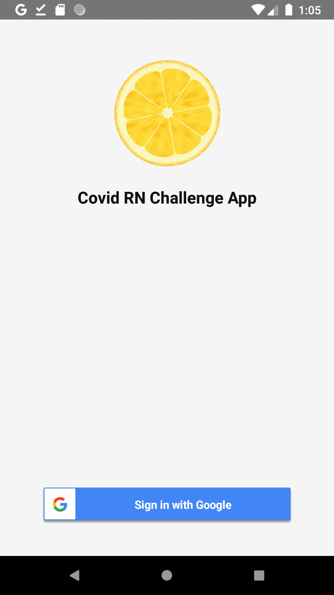
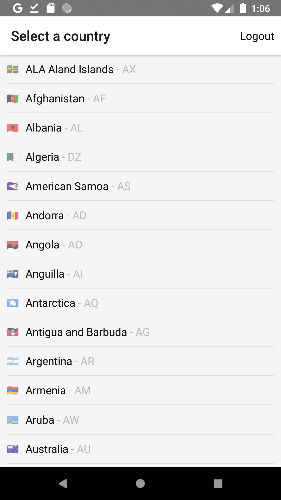
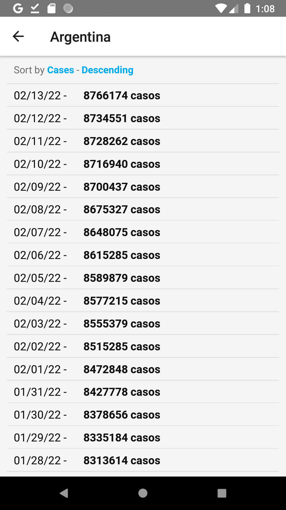

# React Native Challenge App
It is a sample mobile app that shows COVID information using React Native. 

## Environment
- React Native: `v0.67.2`
- React: `17.0.2.`
- Redux: `4.1.2`
- React Redux - `7.2.6`
- React Navigation `v5`

## Screenshots

## TO DO
- Add Icon
- Add Splash
- Support different Themes
- Remove hardcoded values
- Prepare for Localization
- Add a search input to filter countries quickly
- Add number format with thousand separator to show cases number
- Add pull to refresh 
- Add a reducer for Countries data with persistation 
- Imlement APIs and services requests as Middlewares with Redux Thunk
- Implement tests:
   - Unit tests
   - Integration tests
   - UI tests
   - End-to-end tests
